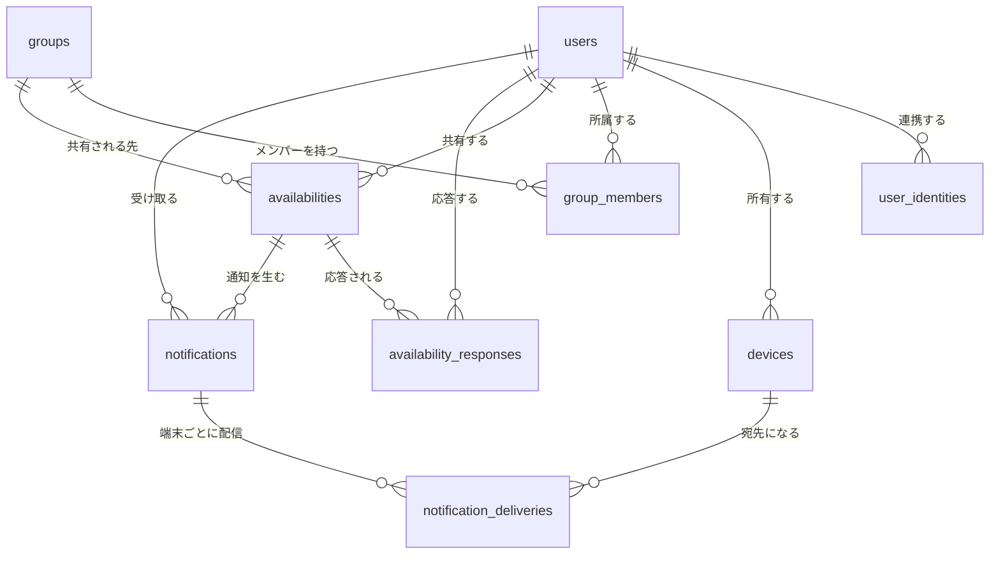

# テーブル設計

正となる定義は [`db/migrations`](../db/migrations) にある。このドキュメントは
その意図と、制約をそう置いた理由を説明する。
[ドキュメント一覧に戻る](README.md)

## 全体図



## 設計方針

### 主キーは内部の uuid にする

ID トークンの `sub` や APNs デバイストークンは外部システムが発行する識別子であり、
値が変わりうる。特に APNs トークンはアプリの再インストールで再発行される。
これを主キーに置くと、値が変わった時点で古い行が孤児として残り、
新旧を紐づける手段が無くなる。外部の識別子は UNIQUE 制約付きの通常の列として持つ。

`sub` については、認証プロバイダを増やせるよう
[`user_identities`](#user_identities) という別テーブルに切り出している。

### 消さずに打刻する

退出・取り消し・失効はいずれも論理削除で表現する。

| テーブル | 列 | 意味 |
|---------|----|------|
| `group_members` | `left_at` | 退出した |
| `availabilities` | `cancelled_at` | 共有を取り消した |
| `devices` | `revoked_at` | トークンが無効になった |

物理削除にすると `ON DELETE CASCADE` で過去の履歴まで消える。
たとえば退出した利用者の `availabilities` が消えると、それに紐づく
通知や応答まで連鎖的に失われる。

### 状態を部分索引で表現する

論理削除と組み合わせて、有効な行だけを対象にした部分索引を置く。
条件が索引に入っているため、履歴が増えても走査対象は有効なぶんだけに保たれる。

```sql
CREATE UNIQUE INDEX group_members_active_uniq
    ON group_members (group_id, user_id)
    WHERE left_at IS NULL;
```

この 1 行で「在籍中の重複は禁止」と「退出後の再参加は許可」が同時に成立する。
アプリ側でチェックしてから INSERT する方式では、同時リクエストで
両方がチェックを通過する隙間が残る。

## テーブル

### users

| カラム | 型 | 制約・備考 |
|--------|----|-----------|
| `id` | `uuid` | 主キー。`gen_random_uuid()` |
| `display_name` | `text` | NOT NULL |
| `email` | `text` | UNIQUE。匿名ログインを許容するため NULL 可 |
| `created_at` / `updated_at` | `timestamptz` | NOT NULL |

`email` を NULL 可にしているのは Firebase の匿名認証に対応するため。
PostgreSQL の UNIQUE は NULL を重複とみなさないので、複数行が NULL でも問題ない。

認証の識別子はこのテーブルに置かない。`users` は
[UC-07](usecases/groups.md#uc-07-グループメンバーの一覧) のメンバー一覧で
広く参照されるため、サインインの主体を特定できる値を同居させたくない。

### user_identities

| カラム | 型 | 制約・備考 |
|--------|----|-----------|
| `id` | `uuid` | 主キー |
| `user_id` | `uuid` | NOT NULL → `users(id)` ON DELETE CASCADE |
| `provider` | `text` | NOT NULL CHECK IN (`firebase`, `google`, `apple`, `line`) |
| `subject` | `text` | NOT NULL。ID トークンの `sub` クレーム |
| `created_at` / `updated_at` | `timestamptz` | NOT NULL |

1 人の利用者が複数のプロバイダでサインインできるように、認証の識別子を
別テーブルへ切り出している。`users.firebase_uid` の列のままでは
1 対 1 に固定され、プロバイダを増やすたびに列が増える。

#### キーが (provider, subject) の組である理由

OIDC の `sub` は **発行者（`iss`）の中でしか一意性が保証されない**。
異なるプロバイダが同じ `sub` 文字列を発行する可能性は仕様上排除されていない。

```sql
CONSTRAINT user_identities_provider_subject_uniq UNIQUE (provider, subject)
```

`provider` は `iss` と 1 対 1 に対応する短い名前で、対応付けはトークン検証層が持つ。
`iss` をそのまま持たないのは、URL の表記揺れを索引に持ち込まないため。

この UNIQUE はもう 1 つの役割を果たす。他人の連携を自分に付け替えようとする
INSERT を弾くので、アカウント乗っ取りの経路がここで閉じる。

#### 連携の追加

新しいプロバイダの連携は素の INSERT で行える。RLS の
`user_id = app_current_user_id()` が自分の行に限定し、上の UNIQUE が
既に誰かのものになっている identity を拒否する。専用の関数は要らない。

```sql
CREATE UNIQUE INDEX user_identities_user_provider_uniq
    ON user_identities (user_id, provider);
```

こちらは「同じプロバイダを 1 人に二重に紐づけない」ための制約で、
`user_id` での引き当て（連携済み一覧）の索引も兼ねる。

### devices

| カラム | 型 | 制約・備考 |
|--------|----|-----------|
| `id` | `uuid` | 主キー |
| `user_id` | `uuid` | NOT NULL → `users(id)` ON DELETE CASCADE |
| `platform` | `text` | NOT NULL CHECK IN (`ios`, `android`) |
| `push_token` | `text` | NOT NULL / UNIQUE |
| `apns_environment` | `text` | CHECK IN (`sandbox`, `production`) |
| `revoked_at` | `timestamptz` | 無効トークンの打刻 |
| `last_registered_at` | `timestamptz` | NOT NULL |
| `created_at` / `updated_at` | `timestamptz` | NOT NULL |

`push_token` の UNIQUE は、端末の所有者が変わったときに 1 行の
UPDATE で付け替えられるようにするためのもの。

### groups

| カラム | 型 | 制約・備考 |
|--------|----|-----------|
| `id` | `uuid` | 主キー。サーバーが生成する |
| `name` | `text` | NOT NULL |
| `invite_code` | `text` | NOT NULL / UNIQUE |
| `created_by` | `uuid` | → `users(id)` ON DELETE SET NULL |
| `created_at` / `updated_at` | `timestamptz` | NOT NULL |

`created_by` を SET NULL にしているのは、作成者が退会してもグループ自体は
残す必要があるため。

### group_members

| カラム | 型 | 制約・備考 |
|--------|----|-----------|
| `id` | `uuid` | 主キー |
| `group_id` | `uuid` | NOT NULL → `groups(id)` ON DELETE CASCADE |
| `user_id` | `uuid` | NOT NULL → `users(id)` ON DELETE CASCADE |
| `role` | `text` | NOT NULL DEFAULT `member` CHECK IN (`owner`, `member`) |
| `joined_at` | `timestamptz` | NOT NULL |
| `left_at` | `timestamptz` | 退出の打刻 |

### availabilities

| カラム | 型 | 制約・備考 |
|--------|----|-----------|
| `id` | `uuid` | 主キー |
| `group_id` | `uuid` | NOT NULL → `groups(id)` ON DELETE CASCADE |
| `user_id` | `uuid` | NOT NULL → `users(id)` ON DELETE CASCADE |
| `duration_minutes` | `int` | NOT NULL CHECK (> 0) |
| `message` | `text` | NULL 可 |
| `started_at` | `timestamptz` | NOT NULL |
| `expires_at` | `timestamptz` | NOT NULL。トリガーが導出する |
| `cancelled_at` | `timestamptz` | 取り消しの打刻 |
| `created_at` / `updated_at` | `timestamptz` | NOT NULL |

`expires_at` はアプリ側から渡さない。`BEFORE INSERT OR UPDATE` トリガーが
`started_at + duration_minutes` を計算して上書きする。

生成列（`GENERATED ALWAYS AS ... STORED`）を使えないのは、
`timestamptz + interval` がタイムゾーン設定に依存する `STABLE` な演算であり、
生成列が要求する `IMMUTABLE` を満たさないため。実際に定義しようとすると
`generation expression is not immutable` で拒否される。

### availability_responses

| カラム | 型 | 制約・備考 |
|--------|----|-----------|
| `id` | `uuid` | 主キー |
| `availability_id` | `uuid` | NOT NULL → `availabilities(id)` ON DELETE CASCADE |
| `user_id` | `uuid` | NOT NULL → `users(id)` ON DELETE CASCADE |
| `action` | `text` | NOT NULL CHECK IN (`join`, `decline`) |
| `source` | `text` | NOT NULL CHECK IN (`user`, `auto_timeout`) |
| `responded_at` | `timestamptz` | NOT NULL |

UNIQUE (`availability_id`, `user_id`) により二重応答を DB が弾く。
`source` は明示的な辞退と 30 秒無操作による自動辞退を区別するためのもの。

### notifications

| カラム | 型 | 制約・備考 |
|--------|----|-----------|
| `id` | `uuid` | 主キー。ペイロードの `notification_id` として送る |
| `kind` | `text` | NOT NULL CHECK IN (`availability_invite`, `response_result`) |
| `availability_id` | `uuid` | → `availabilities(id)` ON DELETE CASCADE |
| `recipient_user_id` | `uuid` | NOT NULL → `users(id)` ON DELETE CASCADE |
| `title` / `body` | `text` | NOT NULL |
| `payload` | `jsonb` | NOT NULL DEFAULT `'{}'` |
| `expanded_at` | `timestamptz` | 端末ごとの配信へ展開した打刻 |
| `created_at` | `timestamptz` | NOT NULL |

宛先 1 人につき 1 行。iOS が `notification_id` を未応答検知のキーに使うため、
受信者ごとに一意である必要がある。

`expanded_at IS NULL` の部分索引が、配信ワーカーの展開フェーズの取り出し口に
なる。有効な端末が 1 台も無い利用者宛の通知は配信行が 0 件になるため、
`notification_deliveries` の有無では展開済みかを判定できない。

### notification_deliveries

| カラム | 型 | 制約・備考 |
|--------|----|-----------|
| `id` | `uuid` | 主キー |
| `notification_id` | `uuid` | NOT NULL → `notifications(id)` ON DELETE CASCADE |
| `device_id` | `uuid` | NOT NULL → `devices(id)` ON DELETE CASCADE |
| `status` | `text` | NOT NULL DEFAULT `pending` CHECK IN (`pending`, `sent`, `failed`) |
| `apns_id` | `text` | APNs が返す `apns-id` |
| `error_reason` | `text` | `BadDeviceToken` など |
| `attempts` | `int` | NOT NULL DEFAULT 0 |
| `last_attempted_at` | `timestamptz` | NULL 可 |
| `created_at` | `timestamptz` | NOT NULL |

`status = 'pending'` の部分索引が、そのまま配信ワーカーの取り出し口
（アウトボックス）として機能する。

## Row Level Security

`WHERE user_id = $1` の付け忘れや、パスパラメータの検証漏れは、
レビューをすり抜ければそのまま他人のデータの露出になる。
アプリ側の正しさだけに依存しないよう、DB 側に最後の防波堤を置く。

定義は [`000009_enable_row_level_security.up.sql`](../db/migrations/000009_enable_row_level_security.up.sql)。

### 接続ロールを分ける

**RLS はテーブル所有者には既定で適用されない。** 現在の `himasoku` は
Superuser かつ `BYPASSRLS` を持つため、このロールで接続している限り
ポリシーは一切評価されない。接続を用途で分けることが前提になる。

| ロール | 接続文字列 | RLS | 用途 |
|--------|-----------|-----|------|
| `himasoku` | `DATABASE_URL` | 素通り | マイグレーション、配信ワーカー |
| `himasoku_app` | `APP_DATABASE_URL` | 適用される | API のリクエスト処理 |

API が誤って `DATABASE_URL` で接続すると、**エラーも警告も出ないまま
RLS が無効になる**。この点だけは設定ミスが静かに失敗するので注意する。

### 実行主体の伝え方

ポリシーは `app_current_user_id()` を通してセッション変数を読む。

```sql
SET LOCAL app.current_user_id = '<users.id>';
```

`SET LOCAL` はトランザクション終了時に自動で巻き戻る。`SET` を使うと
接続プールに値が残り、同じ接続を再利用した別の利用者のリクエストに
前の利用者の権限が引き継がれる。

未設定なら `app_current_user_id()` は `NULL` を返し、すべての比較が
`NULL`（偽）になって一行も見えない。設定忘れは安全側に倒れる。

### ポリシー一覧

| テーブル | SELECT | INSERT | UPDATE |
|---------|--------|--------|--------|
| `users` | RLS なし | RLS なし | RLS なし |
| `user_identities` | 自分の行のみ | 自分の行のみ | 自分の行のみ |
| `devices` | 自分の行のみ | 自分の行のみ | 自分の行のみ |
| `groups` | 在籍中のグループ | `created_by` が自分 | ポリシーなし（不可） |
| `group_members` | 在籍中のグループの全員 | 自分の行のみ | 自分の行のみ |
| `availabilities` | 在籍中のグループのもの | 自分 かつ 在籍中 | 自分の行のみ |
| `availability_responses` | 自分の応答、自分の暇への応答 | 自分 かつ 暇が可視 | ポリシーなし（不可） |
| `notifications` | 自分宛のみ | 下記の条件 | ポリシーなし（不可） |
| `notification_deliveries` | 自分宛の通知のぶん | ポリシーなし（不可） | ポリシーなし（不可） |

ポリシーを置かないことは「一行も対象にならない」を意味する。
該当するユースケースが無い操作は、明示的に禁止するより
定義しないほうが安全側に倒れる。

### users に RLS を掛けない理由

[UC-07](usecases/groups.md#uc-07-グループメンバーの一覧) で同じグループの
他人の `display_name` を読む必要があるため。「自分の行だけ」では成立しない。

「同じグループの在籍者なら見える」ポリシーを書くこともできるが、
`users` を引くほぼ全ての経路にグループ越しの判定が乗ることになる。
`display_name` は元々グループ内に公開される情報なので、割に合わない。

代償として、アプリロールは全ユーザーの `email` を読める。
外部に出す列はハンドラ側で絞る。認証の識別子は
[`user_identities`](#user_identities) に切り出してあるため、
ここには含まれない。

### なりすましをポリシーで塞ぐ

`notifications` の INSERT は、送信者の申告ではなく DB 上の事実だけを見る。

| `kind` | 作成が許される条件 |
|--------|------------------|
| `availability_invite` | 対象の暇が自分のもの **かつ** 宛先が同じグループの在籍者 |
| `response_result` | 対象の暇の共有者が宛先 **かつ** 自分がその暇に応答済み |

Rails 版は `sender_firebase_uid` を自己申告で受け取っていたため、
認証さえ通れば任意の相手に「◯◯が共感しています」を送れた。
アプリ側で直したとしても、次に同じ経路を書いた人が同じ穴を開けられる。
ポリシーにしておけば DB が拒否する。

### 通知の INSERT に RETURNING は使えない

通知は常に他人宛に作られる。`RETURNING` は挿入した行を読み返す操作なので、
`notifications` の SELECT ポリシー（自分宛のみ）に掛かって失敗する。

```
ERROR:  new row violates row-level security policy for table "notifications"
```

書き込み自体は `WITH CHECK` を通っており、失敗するのは読み返しだけ。
`id` が必要なときは Go 側で uuid を採番して渡す（sqlc なら `:exec`）。

### 境界をまたぐ操作

ポリシーで表現できない操作が 2 つある。いずれも `SECURITY DEFINER`
関数に閉じ込め、関数そのものを検査点にしている。

| 関数 | 用途 | ポリシーで書けない理由 |
|------|------|---------------------|
| `resolve_user_by_identity(provider, subject)` | `sub` から `users.id` を引く（認証ミドルウェア） | `app.current_user_id` の確定前に呼ぶため、自分の行すら見えない |
| `register_user(provider, subject, display_name, email)` | ユーザー登録（[UC-01](usecases/onboarding.md#uc-01-ユーザー登録)） | 同上。加えて 2 テーブルへの冪等な書き込みが 1 文で書けない |
| `register_device(platform, push_token, apns_env)` | 端末の所有者付け替え（[UC-02](usecases/onboarding.md#uc-02-デバイストークンの登録)） | 対象が他人の行。許すポリシーは端末乗っ取りを許すことになる |
| `join_group_by_invite_code(code)` | 招待コードでの参加（[UC-05](usecases/groups.md#uc-05-招待コードでグループに参加)） | 参加前は非メンバーなので `groups` が一行も見えない |

本人確認そのものは、業務のリクエストより一段内側の操作になる。
`app.current_user_id` を設定するための情報を得る処理なので、
その値に依存するポリシーの下には置けない。

`app_is_group_member(group_id)` も `SECURITY DEFINER` にしている。
`group_members` のポリシーから `group_members` を引くと
`infinite recursion detected in policy for relation "group_members"`
になるため、所有者として実行して RLS を経由しない。

### 配信行はワーカーが作る

`notification_deliveries` の作成には宛先の `devices.id` が要るが、
他人の端末は RLS で見えない。「同じグループなら端末が見える」ポリシーを
置くと、デバイストークンをメンバー間に開示することになる。

そのため **API は `notifications` までを作り、それを端末ごとに展開して
`notification_deliveries` を作るのはワーカーの役割** とする。
ワーカーは所有者接続で動くので全端末を引ける。

結果として `notifications` がアウトボックスの入口、
`notification_deliveries` が出口になる。共有時点ではなく送信時点の
端末一覧を使うため、その間に登録された端末にも届くという副次的な利点がある。

## 既存スキーマからの変更点

| 既存（Rails） | 新設計（Go） | 理由 |
|--------------|-------------|------|
| `users.firebase_uid` が主キー | `users.id` が主キー、認証の識別子は `user_identities` | 認証基盤を差し替えても内部 ID と全 FK が壊れない。複数プロバイダも列を増やさずに扱える |
| `user_devices.device_id`（APNs トークン）が主キー | `devices.id` が主キー、`push_token` は UNIQUE 列 | トークンは再発行される。主キーだと旧行が孤児化し、失効も表現できない |
| クライアントが `group_id` を決めて POST | サーバー生成の `id` と `invite_code` | ID を推測した不正参加や、既存グループの上書きを防ぐ |
| 退出の概念なし | `group_members.left_at` | 通知を止める手段を用意する |
| 暇の共有は通知ペイロードのみ | `availabilities` | 「今ヒマな人」の取得・履歴・取り消しが可能になる |
| 応答がクライアント申告 | `availability_responses` | 送信者とグループをサーバーが導出でき、なりすましを防げる |
| `notification_id` を毎回生成して破棄 | `notifications` | 応答との突き合わせ、再送、監査ができる |
| 送信結果は JSON で返すだけ | `notification_deliveries` | 非同期送信のキューを兼ね、無効トークンを自動失効できる |
| 行の可視性はアプリ任せ | `users` 以外に RLS | `WHERE` の付け忘れが他人のデータの露出にならない |
| `simple_users` など 4 テーブル | 廃止 | 現行コードから未使用。旧スキーマの名残 |
