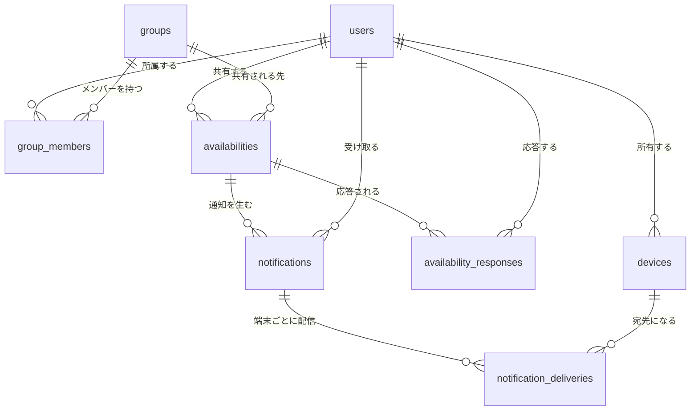

# テーブル設計

正となる定義は [`db/migrations`](../db/migrations) にある。このドキュメントは
その意図と、制約をそう置いた理由を説明する。
[ドキュメント一覧に戻る](README.md)

## 全体図



## 設計方針

### 主キーは内部の uuid にする

`firebase_uid` や APNs デバイストークンは外部システムが発行する識別子であり、
値が変わりうる。特に APNs トークンはアプリの再インストールで再発行される。
これを主キーに置くと、値が変わった時点で古い行が孤児として残り、
新旧を紐づける手段が無くなる。外部の識別子は UNIQUE 制約付きの通常の列として持つ。

### 消さずに打刻する

退出・取り消し・失効はいずれも論理削除で表現する。

| テーブル | 列 | 意味 |
|---------|----|------|
| `group_members` | `left_at` | 退出した |
| `availabilities` | `cancelled_at` | 共有を取り消した |
| `devices` | `revoked_at` | トークンが無効になった |

物理削除にすると `ON DELETE CASCADE` で過去の履歴まで消える。
たとえば退出した利用者の `availabilities` が消えると、それに紐づく
通知や応答まで連鎖的に失われる。

### 状態を部分索引で表現する

論理削除と組み合わせて、有効な行だけを対象にした部分索引を置く。
条件が索引に入っているため、履歴が増えても走査対象は有効なぶんだけに保たれる。

```sql
CREATE UNIQUE INDEX group_members_active_uniq
    ON group_members (group_id, user_id)
    WHERE left_at IS NULL;
```

この 1 行で「在籍中の重複は禁止」と「退出後の再参加は許可」が同時に成立する。
アプリ側でチェックしてから INSERT する方式では、同時リクエストで
両方がチェックを通過する隙間が残る。

## テーブル

### users

| カラム | 型 | 制約・備考 |
|--------|----|-----------|
| `id` | `uuid` | 主キー。`gen_random_uuid()` |
| `firebase_uid` | `text` | NOT NULL / UNIQUE |
| `display_name` | `text` | NOT NULL |
| `email` | `text` | UNIQUE。匿名ログインを許容するため NULL 可 |
| `created_at` / `updated_at` | `timestamptz` | NOT NULL |

`email` を NULL 可にしているのは Firebase の匿名認証に対応するため。
PostgreSQL の UNIQUE は NULL を重複とみなさないので、複数行が NULL でも問題ない。

### devices

| カラム | 型 | 制約・備考 |
|--------|----|-----------|
| `id` | `uuid` | 主キー |
| `user_id` | `uuid` | NOT NULL → `users(id)` ON DELETE CASCADE |
| `platform` | `text` | NOT NULL CHECK IN (`ios`, `android`) |
| `push_token` | `text` | NOT NULL / UNIQUE |
| `apns_environment` | `text` | CHECK IN (`sandbox`, `production`) |
| `revoked_at` | `timestamptz` | 無効トークンの打刻 |
| `last_registered_at` | `timestamptz` | NOT NULL |
| `created_at` / `updated_at` | `timestamptz` | NOT NULL |

`push_token` の UNIQUE は、端末の所有者が変わったときに 1 行の
UPDATE で付け替えられるようにするためのもの。

### groups

| カラム | 型 | 制約・備考 |
|--------|----|-----------|
| `id` | `uuid` | 主キー。サーバーが生成する |
| `name` | `text` | NOT NULL |
| `invite_code` | `text` | NOT NULL / UNIQUE |
| `created_by` | `uuid` | → `users(id)` ON DELETE SET NULL |
| `created_at` / `updated_at` | `timestamptz` | NOT NULL |

`created_by` を SET NULL にしているのは、作成者が退会してもグループ自体は
残す必要があるため。

### group_members

| カラム | 型 | 制約・備考 |
|--------|----|-----------|
| `id` | `uuid` | 主キー |
| `group_id` | `uuid` | NOT NULL → `groups(id)` ON DELETE CASCADE |
| `user_id` | `uuid` | NOT NULL → `users(id)` ON DELETE CASCADE |
| `role` | `text` | NOT NULL DEFAULT `member` CHECK IN (`owner`, `member`) |
| `joined_at` | `timestamptz` | NOT NULL |
| `left_at` | `timestamptz` | 退出の打刻 |

### availabilities

| カラム | 型 | 制約・備考 |
|--------|----|-----------|
| `id` | `uuid` | 主キー |
| `group_id` | `uuid` | NOT NULL → `groups(id)` ON DELETE CASCADE |
| `user_id` | `uuid` | NOT NULL → `users(id)` ON DELETE CASCADE |
| `duration_minutes` | `int` | NOT NULL CHECK (> 0) |
| `message` | `text` | NULL 可 |
| `started_at` | `timestamptz` | NOT NULL |
| `expires_at` | `timestamptz` | NOT NULL。トリガーが導出する |
| `cancelled_at` | `timestamptz` | 取り消しの打刻 |
| `created_at` / `updated_at` | `timestamptz` | NOT NULL |

`expires_at` はアプリ側から渡さない。`BEFORE INSERT OR UPDATE` トリガーが
`started_at + duration_minutes` を計算して上書きする。

生成列（`GENERATED ALWAYS AS ... STORED`）を使えないのは、
`timestamptz + interval` がタイムゾーン設定に依存する `STABLE` な演算であり、
生成列が要求する `IMMUTABLE` を満たさないため。実際に定義しようとすると
`generation expression is not immutable` で拒否される。

### availability_responses

| カラム | 型 | 制約・備考 |
|--------|----|-----------|
| `id` | `uuid` | 主キー |
| `availability_id` | `uuid` | NOT NULL → `availabilities(id)` ON DELETE CASCADE |
| `user_id` | `uuid` | NOT NULL → `users(id)` ON DELETE CASCADE |
| `action` | `text` | NOT NULL CHECK IN (`join`, `decline`) |
| `source` | `text` | NOT NULL CHECK IN (`user`, `auto_timeout`) |
| `responded_at` | `timestamptz` | NOT NULL |

UNIQUE (`availability_id`, `user_id`) により二重応答を DB が弾く。
`source` は明示的な辞退と 30 秒無操作による自動辞退を区別するためのもの。

### notifications

| カラム | 型 | 制約・備考 |
|--------|----|-----------|
| `id` | `uuid` | 主キー。ペイロードの `notification_id` として送る |
| `kind` | `text` | NOT NULL CHECK IN (`availability_invite`, `response_result`) |
| `availability_id` | `uuid` | → `availabilities(id)` ON DELETE CASCADE |
| `recipient_user_id` | `uuid` | NOT NULL → `users(id)` ON DELETE CASCADE |
| `title` / `body` | `text` | NOT NULL |
| `payload` | `jsonb` | NOT NULL DEFAULT `'{}'` |
| `created_at` | `timestamptz` | NOT NULL |

宛先 1 人につき 1 行。iOS が `notification_id` を未応答検知のキーに使うため、
受信者ごとに一意である必要がある。

### notification_deliveries

| カラム | 型 | 制約・備考 |
|--------|----|-----------|
| `id` | `uuid` | 主キー |
| `notification_id` | `uuid` | NOT NULL → `notifications(id)` ON DELETE CASCADE |
| `device_id` | `uuid` | NOT NULL → `devices(id)` ON DELETE CASCADE |
| `status` | `text` | NOT NULL DEFAULT `pending` CHECK IN (`pending`, `sent`, `failed`) |
| `apns_id` | `text` | APNs が返す `apns-id` |
| `error_reason` | `text` | `BadDeviceToken` など |
| `attempts` | `int` | NOT NULL DEFAULT 0 |
| `last_attempted_at` | `timestamptz` | NULL 可 |
| `created_at` | `timestamptz` | NOT NULL |

`status = 'pending'` の部分索引が、そのまま配信ワーカーの取り出し口
（アウトボックス）として機能する。

## 既存スキーマからの変更点

| 既存（Rails） | 新設計（Go） | 理由 |
|--------------|-------------|------|
| `users.firebase_uid` が主キー | `users.id` が主キー、`firebase_uid` は UNIQUE 列 | 認証基盤を差し替えても内部 ID と全 FK が壊れない |
| `user_devices.device_id`（APNs トークン）が主キー | `devices.id` が主キー、`push_token` は UNIQUE 列 | トークンは再発行される。主キーだと旧行が孤児化し、失効も表現できない |
| クライアントが `group_id` を決めて POST | サーバー生成の `id` と `invite_code` | ID を推測した不正参加や、既存グループの上書きを防ぐ |
| 退出の概念なし | `group_members.left_at` | 通知を止める手段を用意する |
| 暇の共有は通知ペイロードのみ | `availabilities` | 「今ヒマな人」の取得・履歴・取り消しが可能になる |
| 応答がクライアント申告 | `availability_responses` | 送信者とグループをサーバーが導出でき、なりすましを防げる |
| `notification_id` を毎回生成して破棄 | `notifications` | 応答との突き合わせ、再送、監査ができる |
| 送信結果は JSON で返すだけ | `notification_deliveries` | 非同期送信のキューを兼ね、無効トークンを自動失効できる |
| `simple_users` など 4 テーブル | 廃止 | 現行コードから未使用。旧スキーマの名残 |
