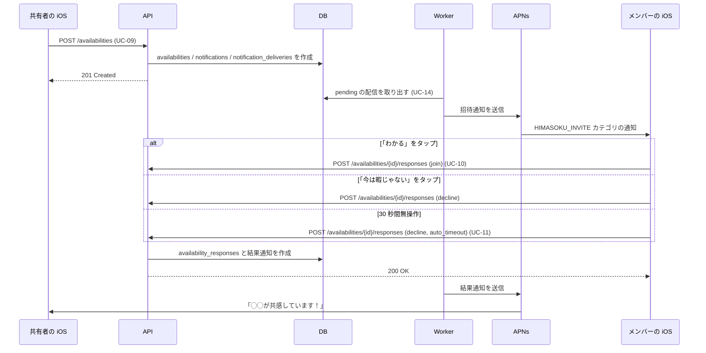
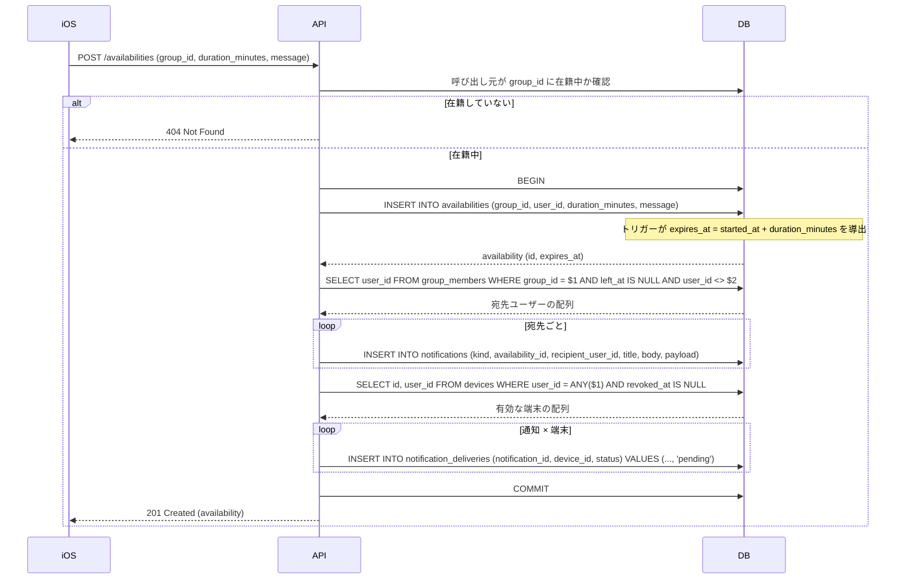
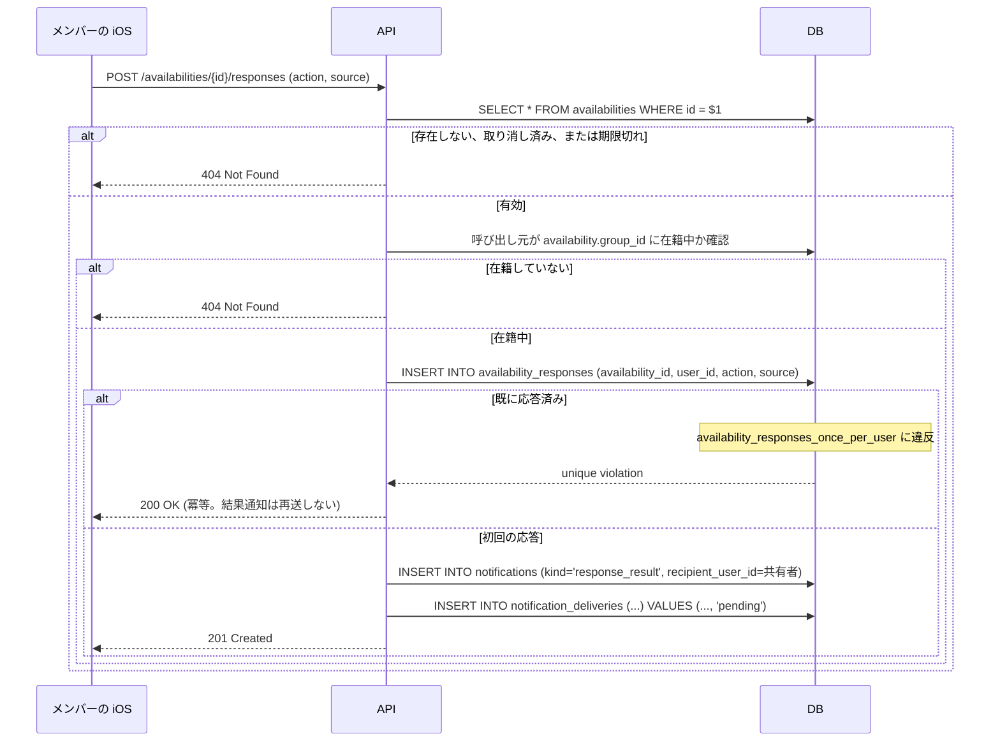
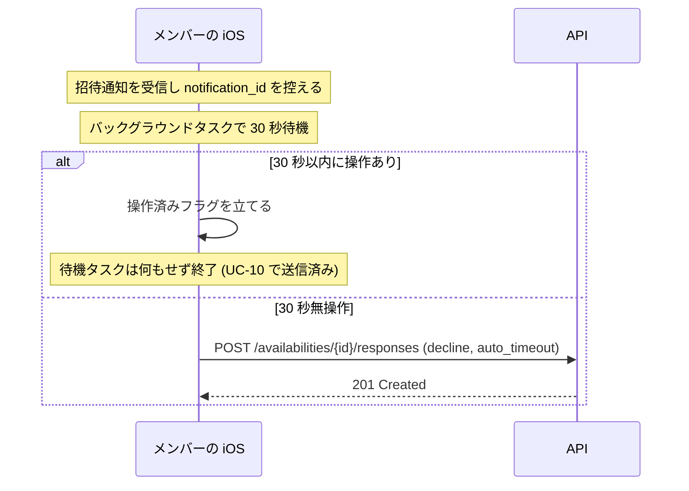
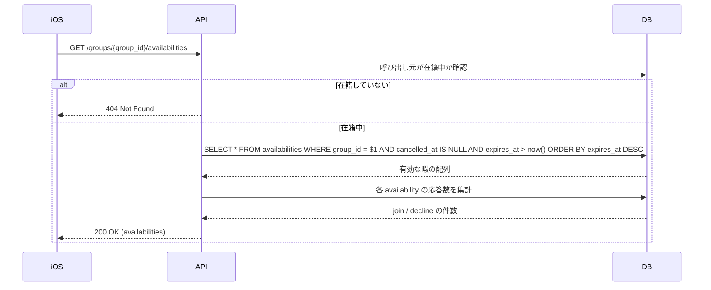
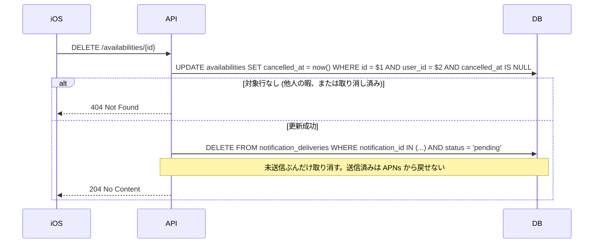

# 暇の共有

このアプリの中心となる機能。「これから N 分ヒマ」をグループに流し、
反応を共有元へ返すまでの一連の流れ。
[ドキュメント一覧に戻る](../README.md)

---

## 全体像



---

## UC-09 暇を共有する

**アクター**: グループに在籍する利用者
**事前条件**: 対象グループに在籍している
**事後条件**: `availabilities` に行ができ、自分以外のメンバー宛の配信が `pending` で積まれる

`POST /availabilities`

```json
{ "group_id": "…", "duration_minutes": 60, "message": "渋谷なう" }
```



### 有効期限をアプリ側で計算しない

`expires_at` は DB のトリガーが `started_at + duration_minutes` から導出する。
アプリ側は値を渡さない。

```sql
CREATE TRIGGER availabilities_set_expires_at
    BEFORE INSERT OR UPDATE OF started_at, duration_minutes ON availabilities
    FOR EACH ROW
    EXECUTE FUNCTION set_availability_expires_at();
```

当初は生成列（`GENERATED ALWAYS AS ... STORED`）で表現する方針だったが、
PostgreSQL では実現できない。`timestamptz + interval` はタイムゾーン設定に
依存するため `STABLE` 扱いで、生成列が要求する `IMMUTABLE` を満たさず
`generation expression is not immutable` で拒否される。トリガーはこの制約を
受けないので、同じ保証を得る手段としてこちらを使っている。

### 通知は宛先ごとに 1 行

`notifications` は「暇 1 件につき 1 行」ではなく「宛先 1 人につき 1 行」作る。
iOS は `notification_id` を未応答検知の待機タスク ID として使うため、
受信者ごとに一意でなければ、誰かが応答した時点で他の端末の待機まで
解除されてしまう。

### 配信は同期で送らない

API は `notification_deliveries` を `pending` で積むところまでを行い、
APNs への送信は [UC-14](notification-delivery.md#uc-14-通知を配信する) のワーカーに委ねる。

### 既存実装との差分

| 項目 | Rails | Go |
|------|-------|-----|
| エンドポイント | `POST /notifications/group/:group_id` | `POST /availabilities` |
| 暇の永続化 | なし（通知ペイロードのみ） | `availabilities` に保存 |
| 送信方式 | 端末ごとに同期送信 | `pending` を積んでワーカーが非同期送信 |
| 在籍チェック | なし | あり |
| レスポンス | `{ total_tokens, successful, failed, details }` | `201` と作成された availability |

> **クライアント影響**: レスポンス形式が変わる。既存の iOS 実装が
> `successful` / `failed` を読んでいる場合は改修が必要。同期送信をやめる以上、
> 送信結果を応答に含めることは原理的にできない。

---

## UC-10 招待通知に応答する

**アクター**: 招待通知を受け取ったメンバー
**事前条件**: 対象の暇がまだ有効（`expires_at > now()` かつ未取消）
**事後条件**: `availability_responses` に行ができ、共有元へ結果通知が積まれる

`POST /availabilities/{availability_id}/responses`

```json
{ "action": "join", "source": "user" }
```



### 送信者とグループをクライアントに申告させない

応答に必要な情報はすべて `availability_id` から辿れる。共有者は
`availabilities.user_id`、グループは `availabilities.group_id` で引ける。

Rails 版は `sender_firebase_uid` と `group_id` をリクエストボディで受け取っていた。
照合先となるレコードが存在しないため、値が正しいかを検証する手段がなく、
認証さえ通れば任意の利用者になりすまして「◯◯が共感しています」という通知を
他人に送れる状態だった。暇を実体として保存する設計上の目的の 1 つがこれになる。

### 二重応答の扱い

`UNIQUE (availability_id, user_id)` で DB が弾く。これが無いと、
[UC-11](#uc-11-無操作による自動辞退) の自動辞退とユーザーの手動操作が競合したときに、
共有者へ「参加」と「辞退」の両方の通知が届く。

### 結果通知の本文

| `action` | 本文 |
|----------|------|
| `join` | `{名前}が共感しています！` |
| `decline` | `{名前}は今は忙しいみたいです😢` |

---

## UC-11 無操作による自動辞退

**アクター**: iOS クライアント（利用者の操作なし）

招待通知を受け取った iOS は 30 秒待ち、利用者が何も操作しなければ
自動的に辞退を送る。この挙動はクライアント側の実装に依存する。



サーバーから見ると [UC-10](#uc-10-招待通知に応答する) と同じ経路を通る。
違いは `source` の値だけで、`user`（明示的な辞退）と `auto_timeout`（無反応）を
区別して記録する。Rails 版は両者が同じ `DECLINE_ACTION` として届いていたため、
「断られた」のか「気づかれなかった」のかを後から判別できなかった。

---

## UC-12 今ヒマな人を見る

**アクター**: グループに在籍する利用者

`GET /groups/{group_id}/availabilities`



`availabilities_active_by_group_idx`（`(group_id, expires_at DESC) WHERE cancelled_at IS NULL`）が効く。

### 既存実装との差分

Rails 版には該当するエンドポイントが存在しない。暇の情報が
APNs のペイロードにしか存在しないため、通知を受け損ねると
その暇には二度とアクセスできなかった。通知が届かなかった端末の利用者や、
後からアプリを開いた利用者が状況を把握する手段がこれで確保される。

---

## UC-13 暇の共有を取り消す

**アクター**: 暇を共有した本人

`DELETE /availabilities/{availability_id}`



取り消しは論理削除にする。物理削除にすると、既に届いた招待通知に対する
応答が外部キー制約で失敗し、クライアントがエラーを受け取ることになる。
`cancelled_at` を打刻しておけば [UC-10](#uc-10-招待通知に応答する) が
`404` を返し、「もう終了しています」と伝えられる。

### 既存実装との差分

Rails 版に取り消しの概念はない。一度通知を送ると撤回できなかった。
