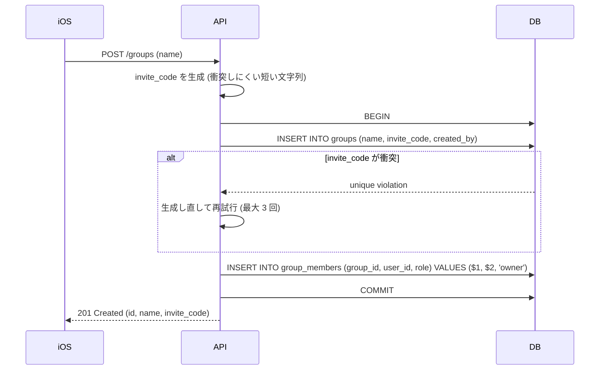
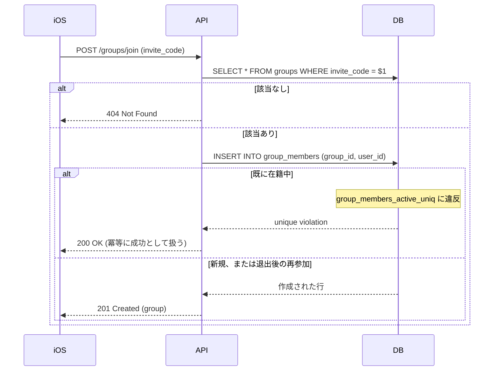
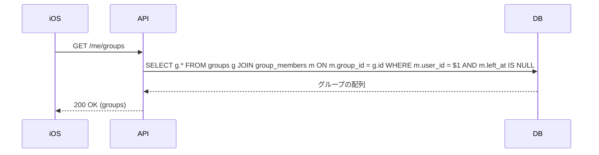
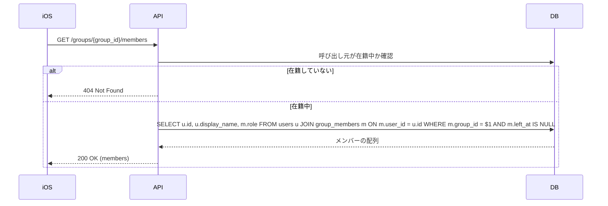
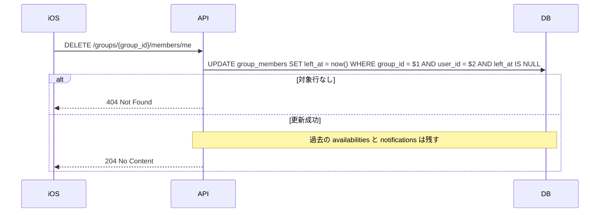

# グループ

暇を共有する相手の単位。グループに所属していない利用者には通知が届かない。
[ドキュメント一覧に戻る](../README.md)

---

## UC-04 グループの作成

**アクター**: iOS 利用者
**事後条件**: `groups` に行が作られ、作成者が `owner` として `group_members` に入る

`POST /groups`

```json
{ "name": "ゼミ" }
```



グループの作成とメンバーへの追加は 1 つのトランザクションにまとめる。
分けると、作成直後に処理が落ちた場合に誰も所属していないグループが残り、
`invite_code` を知らない限り誰も入れない孤児レコードになる。

### 既存実装との差分

| 項目 | Rails | Go |
|------|-------|-----|
| `group_id` | クライアントが指定（`find_or_create_by`） | サーバーが uuid を生成 |
| 作成者の扱い | メンバーに追加されない | `owner` として自動で追加 |
| 参加経路 | `group_id` を知っていれば誰でも | `invite_code` が必要 |

Rails 版はクライアントが `group_id` を決めて `find_or_create_by` していたため、
既存グループと同じ ID を送ると、作成のつもりで他人のグループを引き当ててしまう。
ID が連番や推測可能な文字列の場合、総当たりで任意のグループに入れる状態だった。

---

## UC-05 招待コードでグループに参加

**アクター**: iOS 利用者
**事前条件**: 招待コードを知っている
**事後条件**: `group_members` に在籍行が存在する

`POST /groups/join`

```json
{ "invite_code": "INVITE1" }
```



### 在籍の一意性

重複参加は部分ユニーク索引で DB が弾く。

```sql
CREATE UNIQUE INDEX group_members_active_uniq
    ON group_members (group_id, user_id)
    WHERE left_at IS NULL;
```

`left_at IS NULL` の条件が付いているため、**退出済みの行は制約の対象外**になる。
結果として「在籍中の重複は禁止」と「退出後の再参加は許可」が同時に成立する。
アプリ側で在籍チェックをしてから INSERT する方式だと、同時リクエストで
両方がチェックを通過して二重に入る余地が残るが、この索引ならその隙間がない。

---

## UC-06 所属グループの一覧

`GET /me/groups`



`group_members_active_by_user_idx`（`user_id` に対する `left_at IS NULL` の部分索引）が効く。

---

## UC-07 グループメンバーの一覧

`GET /groups/{group_id}/members`



在籍していない場合に `403` ではなく `404` を返すのは、グループの存在自体を
伏せるため。`403` だと「そのグループは実在する」という情報が漏れる。

---

## UC-08 グループからの退出

`DELETE /groups/{group_id}/members/me`



退出は論理削除（`left_at` への打刻）で行う。物理削除にすると、退出した利用者が
過去に共有した `availabilities` や、その応答が外部キー制約で巻き添えになる。
履歴を保ったまま「以降の通知対象から外す」ことだけを表現したいので、
在籍判定は常に `left_at IS NULL` で行う。

### 既存実装との差分

Rails 版に退出の概念はなく、`DELETE` エンドポイントも存在しない。
一度参加したら通知を止める手段がなかった。
