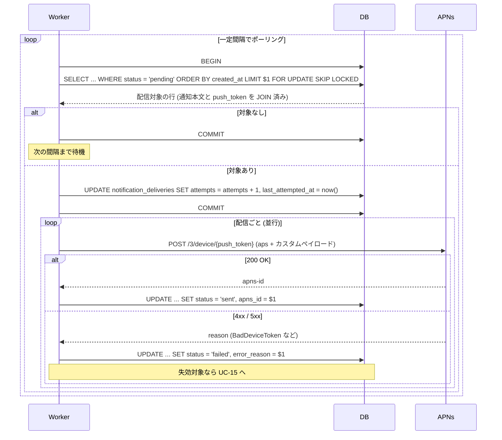
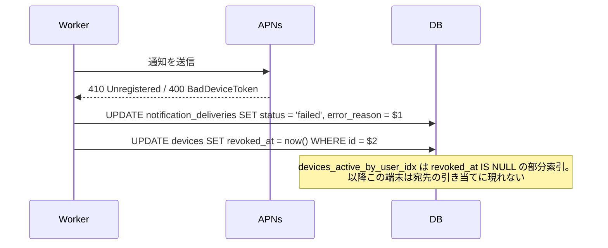

# 通知配信

`notification_deliveries` に積まれた配信を APNs へ送り、結果を記録するまで。
API のリクエスト処理とは独立した非同期の経路になる。
[ドキュメント一覧に戻る](../README.md)

---

## UC-14 通知を配信する

**アクター**: 配信ワーカー（利用者の操作を伴わない）
**事前条件**: `notification_deliveries` に `status = 'pending'` の行がある
**事後条件**: 各行が `sent` または `failed` に遷移している



### 取り出しに FOR UPDATE SKIP LOCKED を使う

複数のワーカー（またはインスタンス）が同時にポーリングしても、
同じ配信を二重に送らないため。`SKIP LOCKED` は他のトランザクションが
ロック中の行を待たずに読み飛ばすので、ワーカー同士がブロックし合わない。

取り出しは部分索引がそのまま作業キューとして機能する。

```sql
CREATE INDEX notification_deliveries_pending_idx
    ON notification_deliveries (created_at)
    WHERE status = 'pending';
```

`status = 'pending'` の条件が索引側に入っているため、送信済みの行が
いくら増えても走査対象は未送信ぶんだけに保たれる。

### カスタムペイロードのキー契約

iOS 側は招待通知で次の 5 キーが揃わないと待機処理を中断する。
DB 構造を変えてもこのキー名と型は変更できない。

| キー | 型 | 供給元 |
|------|----|--------|
| `notification_id` | String | `notifications.id` |
| `sender_firebase_uid` | String | `availabilities.user_id` → `users.firebase_uid` |
| `sender_name` | String | `users.display_name` |
| `group_id` | String | `availabilities.group_id` |
| `durationTime` | **String** | `availabilities.duration_minutes` を文字列化 |

> `durationTime` を数値のまま送ると iOS 側の `as? String` が nil を返し、
> 30 秒の自動辞退（[UC-11](availability-sharing.md#uc-11-無操作による自動辞退)）が
> 静かに動かなくなる。通知自体は表示されるため気づきにくい。
> DB では `int` で持ち、ペイロード生成時に必ず文字列へ変換する。

結果通知では次の 3 キーを送る。

| キー | 型 | 供給元 |
|------|----|--------|
| `action` | String | `JOIN` / `DECLINE` |
| `user_name` | String | 応答した利用者の `display_name` |
| `user_id` | String | 応答した利用者の `users.id` |

### 通知テンプレート

| 種別 | `kind` | aps の主なキー |
|------|--------|----------------|
| 招待通知 | `availability_invite` | `category: HIMASOKU_INVITE`, `mutable-content: 1`, `content-available: 1` |
| 結果通知 | `response_result` | `content-available: 1`（`category` なし） |

`HIMASOKU_INVITE` はクライアント側で「わかる😮」(`JOIN_ACTION`) と
「今は暇じゃない😢」(`DECLINE_ACTION`) の 2 ボタンに対応する。

### 既存実装との差分

| 項目 | Rails | Go |
|------|-------|-----|
| 送信のタイミング | リクエスト処理中に同期送信 | ワーカーが非同期に送信 |
| 送信結果 | レスポンスに含めるだけ（保存しない） | `notification_deliveries` に保存 |
| 再送 | 不可 | `status` と `attempts` を見て再試行できる |
| 大規模グループ | 人数分だけ応答時間が伸びる | 応答時間は人数に依存しない |

Rails 版は `NotificationService#deliver` が端末ごとに同期送信していたため、
グループの人数がそのまま API の応答時間になり、大規模グループでは
タイムアウトが懸念されていた
（[integrity-findings #6](https://github.com/sawakishuto/HimasokuBackend/blob/main/docs/integrity-findings.md)）。

---

## UC-15 無効になった端末トークンを失効させる

**アクター**: 配信ワーカー
**事前条件**: APNs が `BadDeviceToken` または `Unregistered` を返した
**事後条件**: 該当の `devices` 行に `revoked_at` が打刻され、以降の宛先から外れる



### 失効させる理由

APNs のデバイストークンはアプリの削除や再インストールで無効になる。
放置すると、無効なトークンへの送信が配信のたびに積み重なり、
無駄なリクエストと `failed` 行が増え続ける。

### 物理削除にしない理由

`notification_deliveries.device_id` が `devices` を参照しているため、
行を消すと過去の配信履歴も `ON DELETE CASCADE` で巻き添えになる。
`revoked_at` の打刻であれば履歴を保ったまま宛先からのみ外せる。

また [UC-02](onboarding.md#uc-02-デバイストークンの登録) のとおり、
同じトークンが再発行されて登録し直された場合は `revoked_at` を `NULL` に
戻して復活させる。物理削除だと、この復活時に別の行が作られて
過去の履歴と繋がらなくなる。

### 再試行しないエラーと再試行するエラー

| APNs の応答 | 扱い |
|-------------|------|
| `BadDeviceToken` / `Unregistered` | 端末を失効。再試行しない |
| `TooManyRequests` / `ServiceUnavailable` / `InternalServerError` | `pending` に戻して再試行する |
| `BadCollapseId` などのリクエスト不備 | `failed` のまま。再試行しても直らない |
| `ExpiredProviderToken` | JWT を再生成して再試行する |

`InvalidProviderToken` が恒常的に出る場合は認証情報の不一致を疑う。
Team ID、Key ID、トピック（バンドル ID）、P8 鍵の環境変数名のいずれかが
噛み合っていないことが多い。
