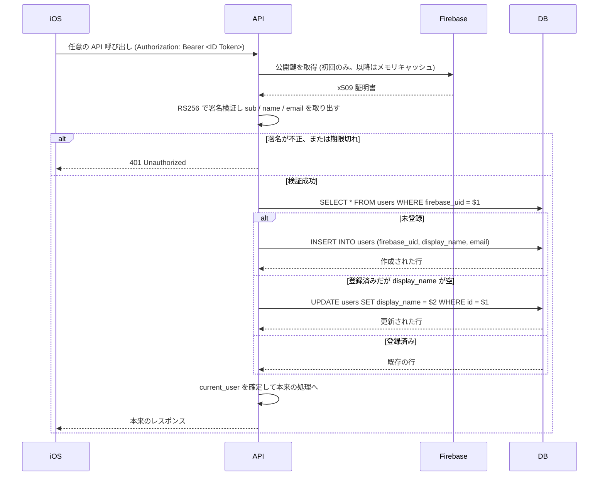
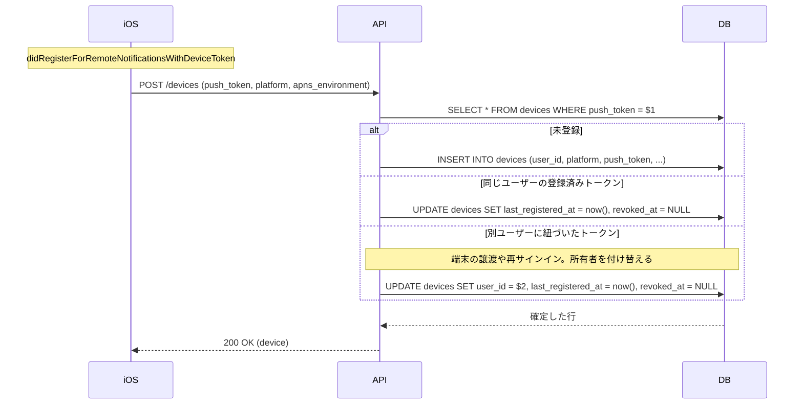
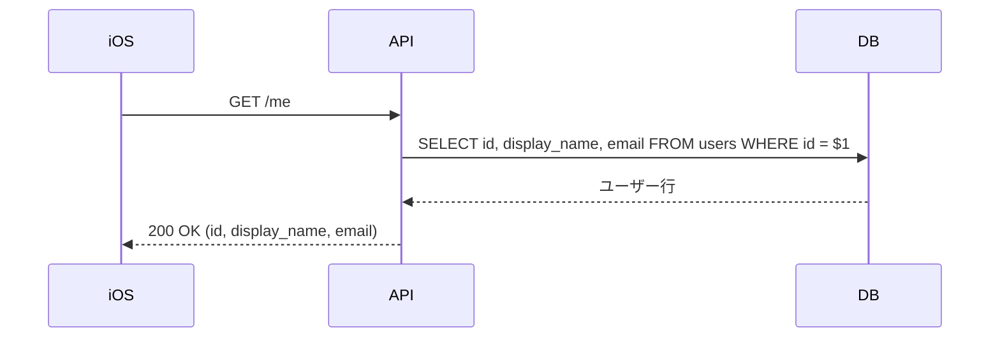

# オンボーディング

アプリを起動してから通知を受け取れる状態になるまで。
[ドキュメント一覧に戻る](../README.md)

---

## UC-01 サインインとユーザーの自動プロビジョニング

**アクター**: iOS 利用者
**事前条件**: Firebase Auth でサインイン済み（ID トークンを保持している）
**事後条件**: `users` に当人の行が存在し、以降のリクエストで `current_user` として解決できる

専用の「ユーザー登録 API」は呼ばない。認証ミドルウェアが未登録の
`firebase_uid` を検出したら、その場で行を作る。iOS 側は初回起動と 2 回目以降で
処理を分ける必要がない。



### 表示名の決定順序

トークンのクレームから次の優先順位で決める。

1. `name`
2. `display_name`
3. `email` のローカル部（`@` より前）

### 既存実装との差分

| 項目 | Rails | Go |
|------|-------|-----|
| プロビジョニングの契機 | `ApplicationController#find_or_provision_user` | 同じ（認証ミドルウェア内） |
| `POST /users` | あり（冪等な作成・補完） | **廃止**。自動プロビジョニングと役割が重複する |
| 公開鍵のキャッシュ | Redis | プロセス内メモリ（TTL は `Cache-Control` に従う） |

Redis を外した理由は、キャッシュ対象が Google の公開鍵のみで、
数 KB かつ全インスタンスで同一のためプロセス内で十分なこと。
既存実装ではキャッシュミス時のフォールバックが壊れており、Redis
のキーが消えると全リクエストが `401` になる不具合があった
（[integrity-findings #2](https://github.com/sawakishuto/HimasokuBackend/blob/main/docs/integrity-findings.md)）。
依存を 1 つ減らすことでこの経路自体を無くす。

---

## UC-02 デバイストークンの登録

**アクター**: iOS 利用者
**事前条件**: APNs からデバイストークンを受け取っている
**事後条件**: `devices` に有効な行が存在し、通知の送信先として引き当てられる

`POST /devices`

```json
{ "platform": "ios", "push_token": "<APNs デバイストークン>", "apns_environment": "sandbox" }
```



### 所有者の付け替えが必要な理由

APNs のデバイストークンは端末に紐づくもので、利用者に紐づくものではない。
同じ端末で別のアカウントにサインインし直すと、同一トークンが別ユーザーの
送信先になる。付け替えを行わないと、前の利用者宛の通知が新しい利用者の端末に
届いてしまう。`push_token` に UNIQUE 制約を置いているのは、この付け替えを
1 行の更新で完結させるため。

### 失効の解除

`revoked_at` を `NULL` に戻す処理を入れている。一度 `BadDeviceToken`
で失効させた端末でも、アプリを再インストールして同じトークンが再発行された場合に
復活させる必要があるため（[UC-15](notification-delivery.md#uc-15-無効になった端末トークンを失効させる) を参照）。

### 既存実装との差分

| 項目 | Rails | Go |
|------|-------|-----|
| 主キー | `device_id`（APNs トークンそのもの） | `id`（uuid）。トークンは UNIQUE 列 |
| 既存トークンの再登録 | そのまま `200` を返すだけ | `last_registered_at` を更新し、失効を解除する |
| 別ユーザーのトークン | 考慮なし（前の所有者に紐づいたまま） | 所有者を付け替える |
| プラットフォーム | APNs 固定 | `platform` 列で ios / android を区別 |

---

## UC-03 プロフィールの取得

**アクター**: iOS 利用者
**事後条件**: なし（参照のみ）

`GET /me`



### 既存実装との差分

Rails には `GET /users`（全ユーザーを無条件に返す）と `GET /users/:id` があった。
前者は利用者全員の `firebase_uid` と `email` を誰にでも開示するため、Go 版では
提供しない。自分自身の情報は `GET /me`、他の利用者は所属グループ越し
（[UC-07](groups.md#uc-07-グループメンバーの一覧)）にのみ参照できる。
