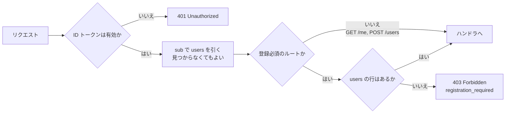
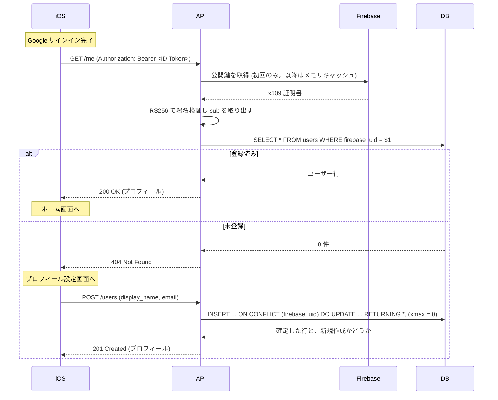
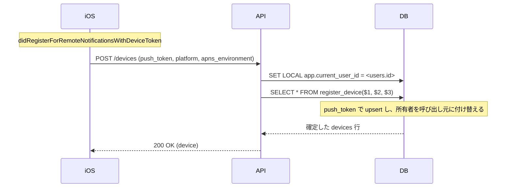
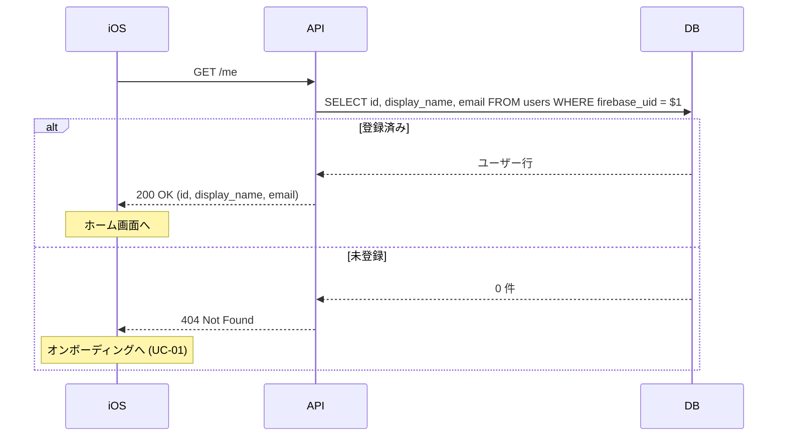

# オンボーディング

アプリを起動してから通知を受け取れる状態になるまで。
[ドキュメント一覧に戻る](../README.md)

---

## 認証と登録を分ける

サインイン（本人確認）とユーザー登録（プロフィールの永続化）は別の関心事として扱う。
認証ミドルウェアは ID トークンを検証し、`sub` から `users` を **引くだけ** で、
行が無くてもエラーにしない。行を作るかどうかを決めるのは `POST /users` だけ。

この結果、リクエストは 3 つの層のいずれかに属する。

| 層 | 対象 | 要求すること |
|----|------|-------------|
| 認証不要 | `GET /health` | なし |
| 認証のみ | `GET /me`, `POST /users` | 有効な ID トークン |
| 認証 + 登録済み | それ以外すべて | 有効な ID トークンと `users` の行 |

`GET /health` を保護しないのは、Cloud Run やロードバランサが資格情報を持たずに
死活監視を叩くため。保護するとすべて失敗する。



「認証は通るが `users` に行が無い」という状態は、この設計で新しく生まれる。
扱いを 1 箇所に閉じ込めるため、判定はミドルウェアの層で行い、個々のハンドラには
`current_user` が必ず存在する前提を与える。

### 実行主体を DB に伝える

`users` の行が確定したら、トランザクションの冒頭でセッション変数を設定する。
[Row Level Security](../schema.md#row-level-security) のポリシーがこの値を読む。

```sql
SET LOCAL app.current_user_id = '<users.id>';
```

`SET LOCAL` であることが重要で、`SET` だと接続プールに値が残り、
同じ接続を再利用した **別の利用者のリクエストに前の利用者の権限が漏れる**。
必ずトランザクション内で `SET LOCAL` を使う。

---

## UC-01 ユーザー登録

**アクター**: iOS 利用者
**事前条件**: Firebase Auth（Google プロバイダ）でサインイン済み
**事後条件**: `users` に当人の行が存在し、`current_user` として解決できる

`POST /users`

```json
{ "display_name": "さわき", "email": "sawaki@example.com" }
```

`firebase_uid` はリクエストボディで受け取らない。ID トークンの `sub` から取る。
クライアントの申告を信じると、任意の利用者になりすませてしまう。



### 存在確認してから分岐しない

`SELECT` で有無を調べてから `INSERT` を選ぶ書き方は競合する。
2 つのリクエストが同時に「行が無い」と判断し、後発が UNIQUE 制約違反で
`500` になる。アプリ起動直後に複数の API を並行で叩くと現実に起きる。

1 文の upsert にすれば分岐自体が消える。

```sql
INSERT INTO users (firebase_uid, display_name, email)
VALUES ($1, $2, $3)
ON CONFLICT (firebase_uid) DO UPDATE
    SET display_name = EXCLUDED.display_name,
        email        = COALESCE(EXCLUDED.email, users.email)
RETURNING *, (xmax = 0) AS created;
```

`xmax = 0` は、その行がこのステートメントで新規挿入されたことを示す。
更新された既存行では `xmax` に更新元のトランザクション ID が入る。
これで `201` と `200` を同じクエリで出し分けられる。

`POST /users` を冪等にしているので、再送やリトライで壊れない。

### 表示名の扱い

トークンの `name` クレームではなく、利用者が入力した値を正とする。
Google アカウントの表示名とアプリ内の呼び名は別物でよい。
クライアントが `display_name` を省略した場合のフォールバックは次の順序。

1. トークンの `name`
2. トークンの `email` のローカル部（`@` より前）

### 途中離脱への対処

Google サインインは完了したがプロフィール設定前にアプリを閉じる、という
状態が発生しうる。Firebase にはアカウントがあり、こちらの DB には無い。

次回起動時も `GET /me` が `404` を返すので、クライアントは同じ導線で
オンボーディングに戻せる。**起動時に必ず `GET /me` を呼ぶ**ことが前提になる。

### 既存実装との差分

| 項目 | Rails | Go |
|------|-------|-----|
| プロビジョニングの契機 | 認証時に `find_or_provision_user` が暗黙に作成 | `POST /users` の明示的な呼び出し |
| 認証層の副作用 | DB への書き込みあり | 参照のみ |
| 表示名 | トークンの `name` を優先 | 利用者の入力を優先 |
| 公開鍵のキャッシュ | Redis | プロセス内メモリ（TTL は `Cache-Control` に従う） |

認証ミドルウェアから書き込みを外したのは、本人確認と業務データの永続化が
別の関心事だから。混ざっていると、プロフィール項目を増やすたびに認証層を
触ることになり、「トークンは有効だが登録を断りたい」といった要求にも応えられない。

Redis を外した理由は、キャッシュ対象が Google の公開鍵のみで、
数 KB かつ全インスタンスで同一のためプロセス内で十分なこと。
既存実装ではキャッシュミス時のフォールバックが壊れており、Redis
のキーが消えると全リクエストが `401` になる不具合があった
（[integrity-findings #2](https://github.com/sawakishuto/HimasokuBackend/blob/main/docs/integrity-findings.md)）。
依存を 1 つ減らすことでこの経路自体を無くす。

---

## UC-02 デバイストークンの登録

**アクター**: 登録済みの利用者
**事前条件**: APNs からデバイストークンを受け取っている
**事後条件**: `devices` に有効な行が存在し、通知の送信先として引き当てられる

`POST /devices`

```json
{ "platform": "ios", "push_token": "<APNs デバイストークン>", "apns_environment": "sandbox" }
```



### UC-01 と同じ POST にまとめない

APNs のデバイストークンは取得タイミングを制御できない。
`didRegisterForRemoteNotificationsWithDeviceToken` が呼ばれるのは OS 都合で、
プロフィール設定を終えた瞬間に手元にあるとは限らない。

まとめると、トークンが来るまで登録を待つ（通知を許可しない利用者が
登録できない）か、トークンを省略可能にする（結局あとで `POST /devices`
が必要）かのどちらかになる。さらにトークンは再発行されるため、
更新用の経路はどのみち必要で、まとめると `devices` への書き込みが
2 箇所に分かれて保守対象が増える。

### 所有者の付け替えが必要な理由

APNs のデバイストークンは端末に紐づくもので、利用者に紐づくものではない。
同じ端末で別のアカウントにサインインし直すと、同一トークンが別ユーザーの
送信先になる。付け替えを行わないと、前の利用者宛の通知が新しい利用者の端末に
届いてしまう。`push_token` に UNIQUE 制約を置いているのは、この付け替えを
1 行の更新で完結させるため。

### なぜ関数越しに書くのか

付け替えの対象は **他人の行** で、RLS のポリシー（`user_id = app_current_user_id()`）
では表現できない。かといって「他人の devices も更新できる」ポリシーを置くと、
端末を乗っ取る手段を与えることになる。

`register_device()` を `SECURITY DEFINER` にして、関数そのものを検査点にする。
`push_token` を知っていること自体がその端末の占有証明になるので、
関数の中では「呼び出し元が渡したトークンの行だけ」を対象にできる。

### 失効の解除

`revoked_at` を `NULL` に戻す処理を入れている。一度 `BadDeviceToken`
で失効させた端末でも、アプリを再インストールして同じトークンが再発行された場合に
復活させる必要があるため（[UC-15](notification-delivery.md#uc-15-無効になった端末トークンを失効させる) を参照）。

### 既存実装との差分

| 項目 | Rails | Go |
|------|-------|-----|
| 主キー | `device_id`（APNs トークンそのもの） | `id`（uuid）。トークンは UNIQUE 列 |
| 既存トークンの再登録 | そのまま `200` を返すだけ | `last_registered_at` を更新し、失効を解除する |
| 別ユーザーのトークン | 考慮なし（前の所有者に紐づいたまま） | 所有者を付け替える |
| プラットフォーム | APNs 固定 | `platform` 列で ios / android を区別 |
| 他人の端末の可視性 | 制限なし | RLS で自分の行のみ |

---

## UC-03 プロフィールの取得

**アクター**: サインイン済みの利用者（登録の有無を問わない）
**事後条件**: なし（参照のみ）

`GET /me`

このエンドポイントは **登録済みかどうかをクライアントに伝える** 役割を兼ねる。
アプリ起動時に必ず呼び、ステータスコードで遷移先を分ける。



### 検証専用のエンドポイントは作らない

「トークンを検証して成功だけ返す」エンドポイントには情報量が無い。
クライアントは既にトークンを持っていて、Firebase SDK 自身が有効性を知っている。
サーバーが「検証できました」と返しても、クライアントが新たに得るものは無く、
往復のレイテンシだけが増える。

一方「登録が済んでいるか」はサーバーにしか分からない。`GET /me` の
ステータスコードでそれを伝えれば、専用エンドポイントは不要になる。

### 既存実装との差分

Rails には `GET /users`（全ユーザーを無条件に返す）と `GET /users/:id` があった。
前者は利用者全員の `firebase_uid` と `email` を誰にでも開示するため、Go 版では
提供しない。自分自身の情報は `GET /me`、他の利用者は所属グループ越し
（[UC-07](groups.md#uc-07-グループメンバーの一覧)）にのみ参照できる。
